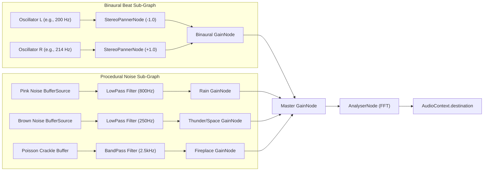
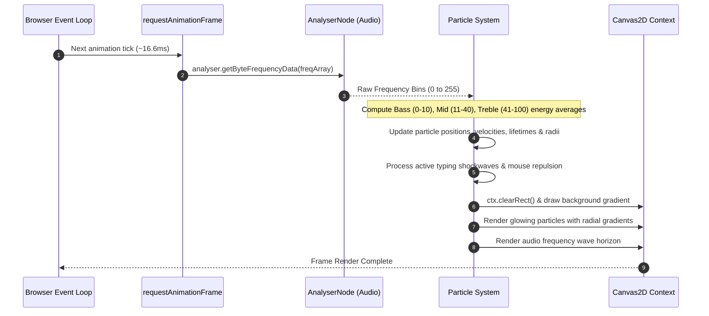
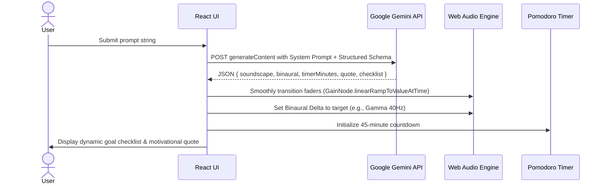

# System Architecture & Technical Design Document

## Project Name: BeatFlow
**Tech Stack:** React 19 + Vite, TypeScript/JavaScript, Vanilla CSS Design System, Web Audio API, HTML5 Canvas 2D, Google Gemini API  
**Target Environment:** Client-Side Web Application (Vercel / Netlify Static Deployment)  
**Author:** Tanmay & Antigravity Lead Architect  
**Version:** 1.0.0  

---

## 1. System Architecture Overview

BeatFlow is architected as a high-performance, client-side single-page application (SPA) with zero heavy server dependencies. The application is divided into three synchronized subsystems:
1. **Procedural Web Audio Engine (DSP Layer)**: Synthesizes continuous ambient noise buffers and stereo binaural oscillations in real-time.
2. **Audio-Reactive Visual Engine (Rendering Layer)**: Connects to the Web Audio `AnalyserNode` to drive a 60 FPS physics-based particle canvas.
3. **AI Session Architect & Productivity Controller (Application Layer)**: Manages UI state, Pomodoro sessions, and communicates with the Google Gemini API for intelligent context-to-preset mapping.

```mermaid
graph TD
    User["👤 User Interaction (Mouse / Keys / UI Sliders)"]
    
    subgraph "Application Layer (React UI & State)"
        UI["Modern Glassmorphism UI"]
        State["App State (Channels, Timer, Visual Theme)"]
        AI["Gemini Focus Architect (Structured Output)"]
    end

    subgraph "Web Audio DSP Engine (Native Browser)"
        Ctx["AudioContext (44.1kHz / 48kHz)"]
        Binaural["Dual Sine Oscillators (L: carrier, R: carrier + delta)"]
        NoiseGen["Procedural Buffer Generators (Pink/Brown/Rain/Fire)"]
        PannerL["Stereo Panner (-1.0)"]
        PannerR["Stereo Panner (+1.0)"]
        Filters["BiquadFilterNodes (LowPass / BandPass)"]
        Gains["GainNodes (Channel Faders & Master Gain)"]
        Analyser["AnalyserNode (FFT 256/512 Bins)"]
        Dest["🔊 AudioDestination (Speakers/Headphones)"]
    end

    subgraph "Visual Rendering Engine (Canvas 2D)"
        Canvas["HTML5 2D Canvas (Hardware Accelerated)"]
        ParticleSystem["Particle Physics Engine (Velocity, Life, Hue)"]
        KeystrokeShockwave["Keystroke Shockwave Generator"]
        RAF["requestAnimationFrame Loop (60 FPS)"]
    end

    User -->|Prompts| AI
    AI -->|Config JSON| State
    User -->|Keystrokes / Mouse| KeystrokeShockwave
    User -->|Fader Adjustments| State

    State -->|Param Updates| Gains
    State -->|Frequency Shifts| Binaural
    State -->|Theme Selection| ParticleSystem

    Ctx --> Binaural
    Ctx --> NoiseGen
    Binaural --> PannerL & PannerR
    NoiseGen --> Filters
    PannerL & PannerR & Filters --> Gains
    Gains --> Analyser
    Analyser --> Dest

    Analyser -->|getByteFrequencyData()| ParticleSystem
    KeystrokeShockwave --> ParticleSystem
    RAF --> ParticleSystem
    ParticleSystem --> Canvas
```

---

## 2. Technology Stack & Technical Rationale

| Layer | Chosen Technology | Rationale & Alternatives Considered |
| :--- | :--- | :--- |
| **Framework & Build** | **React 19 + Vite** | Blazing-fast hot module replacement (HMR), minimal overhead, clean component lifecycle hooks. |
| **Audio Processing** | **Web Audio API** | Native browser API capable of hardware-accelerated DSP, sub-millisecond precision, and zero external MP3 file download latency. |
| **Visual Rendering** | **HTML5 Canvas 2D** | Lightweight, high-throughput 60 FPS rendering of 300+ particles with custom glow blend modes (`ctx.globalCompositeOperation = 'lighter'`). Avoids bulky 3D engine overhead (e.g. Three.js). |
| **AI Intelligence** | **Google Gemini API** | Ultra-fast multimodal and reasoning capabilities, supports strict JSON structured output schema for deterministic audio configuration. |
| **Styling & Theme** | **Vanilla CSS (Design Tokens & HSL)** | Complete control over backdrop-blur filters, glowing borders, custom slider thumbs, fluid typography without framework bloat. |

---

## 3. Web Audio DSP Pipeline & Audio Node Graph



### 3.1 Mathematical Sound Generation Algorithms
1. **Pink Noise Generation (Voss-McCartney Algorithm):** Pink noise exhibits equal energy per octave (\(1/f\) power spectrum). Generated using cascaded first-order recursive white-noise filters to simulate natural rainfall.
2. **Brownian / Red Noise Generation:** Integrated white noise (\(1/f^2\) power spectrum), simulating deep rolling thunder, sub-bass space rumble, or heavy ocean swells.
3. **Poisson Crackle Synthesis:** Randomized micro-pulses modeled with Poisson distribution intervals passing through high-Q bandpass resonance to replicate wood fire crackling.
4. **Binaural Entrainment:**
   $$\text{Left Ear Frequency} = f_c$$
   $$\text{Right Ear Frequency} = f_c + \Delta f$$
   Where \(f_c\) is the carrier frequency (e.g., \(216\text{ Hz}\)) and \(\Delta f\) is the brainwave target:
   * **Alpha:** \(\Delta f = 10\text{ Hz}\) (Reading / Calm Alertness)
   * **Beta:** \(\Delta f = 18\text{ Hz}\) (Active Coding / Problem Solving)
   * **Gamma:** \(\Delta f = 40\text{ Hz}\) (Peak DSA / LeetCode Sprint)

---

## 4. Visual Rendering Pipeline & Particle Engine (60 FPS)



---

## 5. Gemini AI "Focus Architect" Integration

### 5.1 Request Flow
When a user types a natural-language intention (e.g., *"I need to lock in for 45 minutes to finish my LNMIIT operating systems assignment"*):



### 5.2 Structured Output Schema
```json
{
  "sessionName": "Operating Systems Deep Lock-In",
  "recommendedDurationMinutes": 45,
  "binaural": {
    "carrierHz": 216,
    "targetWave": "Gamma",
    "beatHz": 40,
    "volume": 0.45
  },
  "soundscape": {
    "rain": 0.7,
    "thunder": 0.3,
    "fire": 0.15,
    "deepSpace": 0.5
  },
  "visualTheme": "cyberpunk",
  "focusQuote": "Processes yield, threads synchronize, but your focus remains atomic.",
  "microGoals": [
    "Draft the semaphore synchronization logic",
    "Identify edge-case deadlocks",
    "Execute and verify test scenarios"
  ]
}
```

---

## 6. Project Directory Structure

```
beatflow/
├── public/
│   └── favicon.svg
├── src/
│   ├── assets/               # Minimal SVG icons
│   ├── audio/                # Web Audio DSP engine
│   │   ├── AudioEngine.ts    # AudioContext lifecycle & node graph manager
│   │   ├── NoiseGenerators.ts# Pink, Brown, Poisson crackle buffer algorithms
│   │   └── BinauralBeat.ts   # Dual oscillator & stereo panner controller
│   ├── canvas/               # 60 FPS Visual engine
│   │   ├── Visualizer.tsx    # Canvas component wrapper
│   │   ├── ParticleEngine.ts # Particle physics & life cycle
│   │   └── ShockwaveEngine.ts# Keystroke & click ripple emitter
│   ├── components/           # React UI components
│   │   ├── Mixer/            # Channel faders, master volume, mute toggles
│   │   ├── VisualControls/   # Visualizer theme selector, sensitivity sliders
│   │   ├── AIAssistant/      # Gemini Focus Architect input & result modal
│   │   ├── Timer/            # Pomodoro countdown ring & sound chime
│   │   └── Header/           # Presets, share URL, and status indicators
│   ├── services/             # External services & AI
│   │   └── geminiService.ts  # Gemini API client & prompt parser
│   ├── styles/               # Design system & CSS tokens
│   │   ├── tokens.css        # Color palette, spacing, typography tokens
│   │   └── main.css          # Glassmorphism, animations, UI layout
│   ├── types/                # TypeScript interfaces & types
│   │   └── index.ts          # State, AudioNodeParams, AIResponse types
│   ├── App.tsx               # Root component & state orchestrator
│   └── main.tsx              # React DOM entry point
├── ARCHITECTURE.md           # This document
├── PRD.md                    # Product Requirements Document
├── package.json              # Project manifest & dependencies
├── tsconfig.json             # TypeScript compiler config
└── vite.config.ts            # Vite bundler configuration
```

---

## 7. Deployment & Quality Assurance

* **Deployment:** Hosted directly on Vercel / Netlify with automated continuous deployment from the GitHub `main` branch.
* **Zero Backend Costs:** 100% static client bundle with client-side API invocation.
* **Testing:** 
  * Audio node disconnect/reconnect memory leak verification.
  * Canvas `requestAnimationFrame` cleanup on component unmount.
  * Browser audio autoplay policy adherence (`AudioContext.resume()` on first user gesture).
